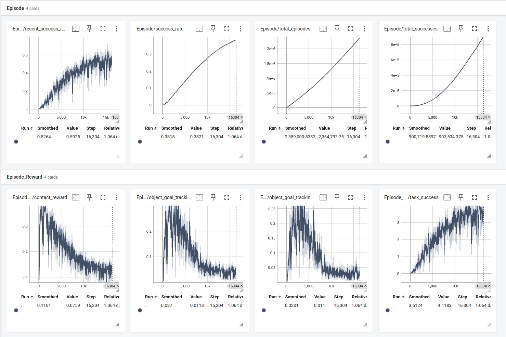

环境测试：

python scripts/record_video.py --task tool-v0 --num_envs 30 --video_length 30 --headless

生成 3s 的会存到 ./videos 的视频，

## Project Overview

This project is a Non-Prehensile Manipulation example/template built on Isaac Lab for Reinforcement Learning (RSL-RL) training and evaluation. It uses the Franka Panda arm, supports multi-asset spawning and domain randomization, tracks success rates, and provides end-to-end train/evaluate/play flows with JIT/ONNX export.

This repository is an Isaac Lab implementation and adaptation of [CORN](https://sites.google.com/view/contact-non-prehensile) (Contact-based Object Representation for Nonprehensile manipulation).

- **Env framework**: Manager-Based RL Env (Isaac Lab)
- **Algorithm**: RSL-RL (PPO)
- **Assets**: Batch loading from a JSON list and local USD/OBJ directories
- **Features**: Training (train), evaluation (eval; success rate + per-object stats), play/export (JIT/ONNX)


## Repository Structure

- `scripts/`: Training, evaluation, play, and shared CLI args
  - `train.py`: Training entrypoint
  - `eval.py`: Evaluation entrypoint (reports success rate and per-object stats)
  - `play.py`: Playback and export to JIT/ONNX
  - `cli_args.py`: Common RSL-RL CLI arguments
- `rsl_rl/`: RSL-RL components/utilities (aligned with Isaac Lab ecosystem)
- `source/IsaacLab_nonPrehensile/IsaacLab_nonPrehensile/`: Python package (task registration, env definition, etc.)
- `logs/`: Training/eval logs, videos, and exported models
- `outputs/`: Optional script outputs


## Prerequisites

- Install Isaac-sim 5.0 (pip install recommended) and Isaac Lab 2.2.0 (Install from source code recommended). Official guide: `https://isaac-sim.github.io/IsaacLab/main/source/setup/installation/source_installation.html`


## Install This Project (editable)

```bash
# From the repository root
python -m pip install -e source/IsaacLab_nonPrehensile
```

After installation, the Gym task is registered as follows:

```9:16:source/IsaacLab_nonPrehensile/IsaacLab_nonPrehensile/tasks/manager_based/isaaclab_nonprehensile/__init__.py
gym.register(
    id="Isaac-nonPrehensile-Franka-v0",
    entry_point=f"{__name__}.env:NonPrehensileEnv",
    disable_env_checker=True,
    kwargs={
        "env_cfg_entry_point": f"{__name__}.env:NonPrehensileEnvCfg",
        "rsl_rl_cfg_entry_point": f"{agents.__name__}.config.rsl_rl_ppo_cfg:NonPrehensilePPORunnerCfg",
    },
)
```


## Data/Assets Paths (Important)

The environment loads object assets (USD/OBJ) from local directories defined in code.

Download the pre-converted dataset from [Hugging Face (Steve3zz/DGN_usd)](https://huggingface.co/datasets/Steve3zz/DGN_usd), unzip it on your machine, and then update the asset paths in the environment config to point to the extracted folder.

Finally, update paths to match your machine:

```234:248:source/IsaacLab_nonPrehensile/IsaacLab_nonPrehensile/tasks/manager_based/isaaclab_nonprehensile/env.py
object = RigidObjectCfg(
    prim_path="{ENV_REGEX_NS}/Object",
    spawn=sim_utils.MultiAssetSpawnerCfg(
        assets_cfg=load_object_candidates("/home/steve/Downloads/DGN/yes.json", usd_dir="/home/steve/Downloads/DGN/coacd_usd_convexhull", obj_dir="/home/steve/Downloads/DGN/coacd_normalized"),
        random_choice=False,
        rigid_props=RigidBodyPropertiesCfg(
            solver_position_iteration_count=16,
            solver_velocity_iteration_count=1,
            max_angular_velocity=1000.0,
            max_linear_velocity=1000.0,
            max_depenetration_velocity=5.0,
            disable_gravity=False,
        ),
    ),
)
```


## Quickstart

### 1. Environment Dependencies

After installing Isaac Lab, run the following commands to install specialized dependencies for the PTV3 encoder:

```bash
# Install Flash Attention (avoiding build isolation for CUDA compatibility)
pip install flash_attn==2.8.3 --no-build-isolation

# Install debugging tools
pip install icecream

# Build and install PyTorch3D from source (required for KNN operations)
git clone -b v0.7.8 --depth 1 https://github.com/facebookresearch/pytorch3d.git
cd pytorch3d
FORCE_CUDA=1 python setup.py bdist_wheel
pip install dist/pytorch3d-0.7.8-cp311-cp311-linux_x86_64.whl
cd ..
```

### 2. Path Configuration

To utilize the customized version of `rsl_rl` included in this repository, export the project root to your `PYTHONPATH`:

```bash
export PYTHONPATH=$HOME/IsaacLab_nonPrehensile:$PYTHONPATH
```

### Train (RSL-RL / PPO)

```bash
python scripts/train.py \
  --task=Isaac-nonPrehensile-Franka-v0 \
  --experiment_name=franka_nonprehensile \
  --num_envs=4096 \
  --video --headless
```

Common options:
- `--video`, `--video_length`, `--video_interval`: record training videos
- `--seed`: random seed (`-1` to sample randomly)
- `--distributed`: multi-GPU/multi-node
- See `scripts/cli_args.py` for shared RSL-RL args (e.g., `--logger`, `--run_name`)

Training logs are saved under: `logs/rsl_rl/<experiment_name>/<time>[_run]`.


### Evaluate (success rate + per-object stats)

```bash
# Automatically resolves checkpoint from the experiment folder
# (use --load_run/--checkpoint for precise selection)
python scripts/eval.py \
  --task=Isaac-nonPrehensile-Franka-v0 \
  --experiment_name=franka_nonprehensile \
  --num_envs=64 \
  --num_episodes=1000
```

- Supports `--video` (only when `num_envs=1`) and `--real_time`
- Results are written to the run directory:
  - `eval_summary.json`: overall success rate
  - `eval_per_object.csv`: per-object success breakdown


### Play & Export (JIT/ONNX)

```bash
python scripts/play.py \
  --task=Isaac-nonPrehensile-Franka-v0 \
  --experiment_name=franka_nonprehensile \
  --num_envs 64 \
  --video --headless
```

- Exports to `logs/.../exported/`: `policy.pt` (JIT) and `policy.onnx`


### Random Agent (baseline/connectivity check)

```bash
python scripts/random_agent.py --task=Isaac-nonPrehensile-Franka-v0
```

> Note: A zero-action agent is not provided. You can adapt from `random_agent.py` if needed.


## Training Results

**Training video** — Demonstrates the learned policy performing non-prehensile manipulation (preview GIF, first few seconds):


[view the full video](asset/video.mp4)

**Training curve** — Reward and success rate vs. environment steps:



These results were obtained on a **single RTX 4090D** with **4096 parallel environments**, trained for approximately **48 hours**.


## Environment Highlights (excerpt)

- Franka Panda joint workspace and initial pose are customizable
- Observations include: point cloud, hand state, robot state, last action, relative goal pose, physical params
- Rewards/terminations target goal tracking, contact shaping, and success completion
- Built-in success statistics and recent-window success rate


## Logging & Visualization

- Training/Eval logs: `logs/rsl_rl/<experiment_name>/<time>...`
- Videos: `logs/.../videos/{train|eval|play}`
- Exported models: `logs/.../exported/{policy.pt, policy.onnx}`

## License

Files in this repository include BSD-3-Clause license headers. Please use and distribute under the corresponding terms.
